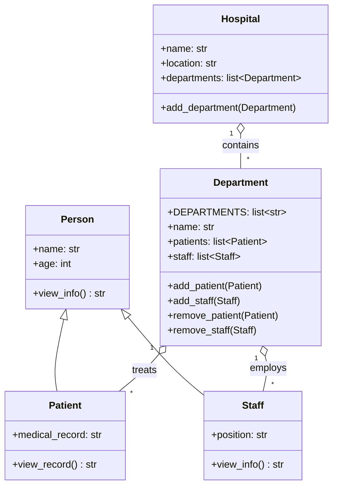
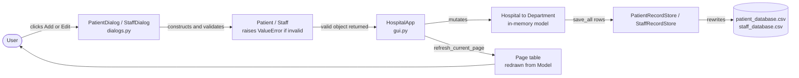

# Hospital Management System

A desktop Hospital Management System built in Python as an OOP graded assignment
for the **DEPI - AMIT** program. It models a hospital's departments, patients and
staff as a small class hierarchy, and exposes that model through a modern
Tkinter/ttkbootstrap desktop application with full CRUD, search, validation and
CSV persistence.

## What It Does

- **Dashboard** — live KPI cards (departments / patients / staff) and a
  "Patients per Department" breakdown built from the current data.
- **Departments** — a read-only view of the hospital's fixed set of
  departments, each with a live-computed patient/staff count.
- **Patients** — search, add, edit and delete patient records (name, age,
  medical record, department).
- **Staff** — search, add, edit and delete staff records (name, age, position,
  department).
- **Validation** — invalid input (empty name, out-of-range age, unknown
  department/position) is rejected with a message instead of corrupting data
  or crashing.
- **Persistence** — every change is written to CSV immediately, so data
  survives closing and reopening the app.

## How to Run It

```bash
pip install -r requirements.txt
python gui.py
```

There is also a small CLI script that exercises the domain model directly,
with no GUI dependency:

```bash
python main.py
```

## How It's Built — Architecture & Engineering Decisions

- **OOP model first.** `Person` is the base class; `Patient` and `Staff`
  inherit from it. `Department` holds patients and staff; `Hospital` holds
  departments. This mirrors the project's UML class diagram directly in code.
- **Validation lives in the model, not the UI.** `Person.name`/`age`,
  `Staff.position` and `Department`'s constructor are Python properties that
  raise `ValueError` on bad data — on construction *and* on any later
  assignment. The GUI's job is only to catch that error and show it; it never
  duplicates the validation rules itself.
- **Departments are fixed, not user-created.** `Department.DEPARTMENTS` is the
  single source of truth for which departments exist. This avoids a whole
  class of bugs (typoed department names, orphaned records) that a free-text
  or separately-stored department list would allow.
- **One-way data flow.** Add/Edit dialogs never touch a table widget directly.
  They validate input and hand back a domain object; the app mutates the
  `Hospital` model; the page then redraws its table *from that model*. The
  table is always a projection of the model, never a second source of truth.
- **CSV persistence rewrites, not appends.** Because the app supports editing
  and deleting records (not just adding them), each store class
  (`PatientRecordStore`, `StaffRecordStore`) rewrites the whole CSV file from
  the in-memory model after every change, instead of only appending — so
  edits and deletes are actually reflected on disk.
- **GUI is one shell, four pages.** `HospitalApp` owns a sidebar and a content
  area; each nav item swaps the content area for a page class (`DashboardPage`,
  `DepartmentsPage`, `PatientsPage`, `StaffPage`). Colors, fonts and widget
  styles are defined once in `configure_styles()` rather than scattered as
  inline styling across widgets.

## Project Structure

| File | Responsibility |
|---|---|
| `main.py` | CLI demo of the domain model only — no GUI, no dependencies beyond the standard library |
| `gui.py` | The desktop app: window shell, sidebar navigation, all four pages, styling |
| `dialogs.py` | Modal Add/Edit forms for patients and staff |
| `config.py` | File paths and hospital name/location constants |
| `person.py` | `Person` — base class with validated `name`/`age` |
| `patient.py` | `Patient(Person)` |
| `patient_store.py` | CSV persistence for patients (`patient_database.csv`) |
| `Staff.py` | `Staff(Person)` |
| `staff_store.py` | CSV persistence for staff (`staff_database.csv`) |
| `Department.py` | `Department` — fixed `DEPARTMENTS` list, holds patients/staff |
| `Hospital.py` | `Hospital` — holds all departments |
| `requirements.txt` | The one external dependency: `ttkbootstrap` |

## Architecture

**Domain model** (matches the project's UML class diagram):



**Application data flow** — how a UI action reaches the model and comes back:



## Team & My Role

*(Order below is arbitrary — not ranked by importance.)*

| Name | Role | GitHub |
|---|---|---|
| Mohamed Hussein — Team Leader | Main & GUI parts | [MohamedHussein0518](https://github.com/MohamedHussein0518) |
| Anas Sayed | Hospital & Config | [Riplinux](https://github.com/Riplinux) |
| Hassan Ali | Staff & Staff Store | [7assan-Ali](https://github.com/7assan-Ali) |
| Ahmed Rabie | Department | [ahmedrabiem](https://github.com/ahmedrabiem) |
| Heba Ramadan | Patient & Patient Store | [eng80022-a11y](https://github.com/hebaramadan1) |
| Maha Khaled | Person | [Maha-123-dot](https://github.com/Maha-123-dot) |

**Under the supervision of:** George Samuel — Instructor
([gsamuei](https://github.com/gsamueil))

---

<div align="center">

# Python Project
### DEPI - AMIT

</div>
